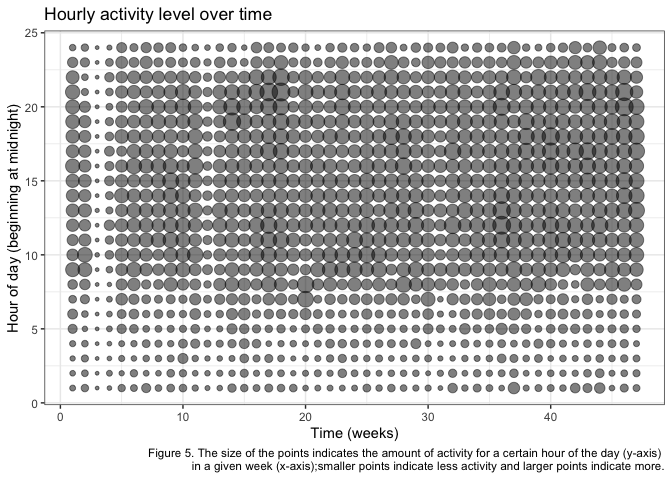

p8105\_mtp\_amv2187
================
Alyssa Vanderbeek
26 October 2018

``` r
accel_data = read.csv('./data/accel_data.csv') %>%
  janitor::clean_names() %>%
  gather(key = minute, value = activity_level, contains('activity')) %>%
  mutate(minute = as.integer(str_sub(minute, 10)),
         day = fct_relevel(day, 'Sunday', 'Monday', 'Tuesday', 'Wednesday', 'Thursday', 'Friday', 'Saturday'),
         hour = ceiling(minute / 60)) %>% # the device records activity units for every minute of the day, so we can break this up into hours of the day, starting at midnight
  arrange(week, day)

str(accel_data)
```

    ## 'data.frame':    473760 obs. of  5 variables:
    ##  $ week          : int  1 1 1 1 1 1 1 1 1 1 ...
    ##  $ day           : Factor w/ 7 levels "Sunday","Monday",..: 1 1 1 1 1 1 1 1 1 1 ...
    ##  $ minute        : int  1 2 3 4 5 6 7 8 9 10 ...
    ##  $ activity_level: num  1 1 1 1 1 1 1 1 1 1 ...
    ##  $ hour          : num  1 1 1 1 1 1 1 1 1 1 ...

``` r
# total activity counts for each day by week
agg_days = accel_data %>%
  group_by(week, day) %>%
  summarise(total_activity = sum(activity_level)) %>%
  ungroup %>%
  mutate(order = row_number())

str(agg_days)
```

    ## Classes 'tbl_df', 'tbl' and 'data.frame':    329 obs. of  4 variables:
    ##  $ week          : int  1 1 1 1 1 1 1 2 2 2 ...
    ##  $ day           : Factor w/ 7 levels "Sunday","Monday",..: 1 2 3 4 5 6 7 1 2 3 ...
    ##  $ total_activity: num  196937 432751 297427 369436 366178 ...
    ##  $ order         : int  1 2 3 4 5 6 7 8 9 10 ...

``` r
# total activity counts by hour for each week and day
agg_hour = accel_data %>%
  group_by(week, day, hour) %>%
  summarise(total_activity_hr = sum(activity_level)) %>%
  ungroup %>%
  mutate(order = row_number())

str(agg_hour)
```

    ## Classes 'tbl_df', 'tbl' and 'data.frame':    7896 obs. of  5 variables:
    ##  $ week             : int  1 1 1 1 1 1 1 1 1 1 ...
    ##  $ day              : Factor w/ 7 levels "Sunday","Monday",..: 1 1 1 1 1 1 1 1 1 1 ...
    ##  $ hour             : num  1 2 3 4 5 6 7 8 9 10 ...
    ##  $ total_activity_hr: num  60 60 60 60 60 60 60 60 60 60 ...
    ##  $ order            : int  1 2 3 4 5 6 7 8 9 10 ...

Data overview
-------------

Here I examine activity levels of a 63-year-old man over the course of several months (47 weeks). The individual has a BMI of 25, and was admitted to the CUMC Advanced Cardiac Care Center for congestive heart failure before participating in this study. The goal of the research is to understand whether activity level changes over time after a major cardiac event, and whether there is potential to gather information about health events from the data surrounding them.

The dataset is comprised of information over 47 weeks (329 days), with information being collected every minute of every day. The resulting dataset is the quite large, with 473760 data points. This information is grouped by week and day of the week, and the minute of the day.

Activity level is measured in voltage by the device, where higher voltage counts indicate higher levels of activity. Of note, there was no missing data per se, but we can understand an activity count of 1 to mean that no activity was recorded in that minute; either the participant was not active or not wearing the device. For example, an entire day of recorded 1 values can be understood as a day on which the man did not wear the device. There were 18 such days recorded.

``` r
# dot plot of minute-to-minute activity level by day of the week across all weeks
accel_data %>%
#    filter(week == 47) %>%
    ggplot(aes(x = minute/60, y = activity_level)) +
    facet_grid(day ~ .) +
    geom_point(alpha = 0.3) +
    labs(
      x = 'Hour of day',
      y = 'Activity level'
    )
```


Exploratory analysis - understanding the data
---------------------------------------------

Upon receiving and tidying the data, I looked at some visualizations of the relationship between activity level and time. I examined the distribution of activity by week, day of the week, and hour of day, and found that the participant was most active during his waking hours, between 7 am and 11 pm, approximately (Figure 1).

### Total daily activity over time

``` r
# loess fit for total daily activity by day of the week
agg_days %>%
  #filter(total_activity != 1440) %>%
  ggplot(aes(x = order, y = total_activity, color = day)) +
  #geom_point() + 
  geom_smooth(method = 'loess', se = F) +
  #facet_grid(day ~ .) +
  labs(
    x = 'Time (days)',
    y = 'Total Activity (daily)'
  )
```


``` r
# Linear model of relationship between time (week, day of the week, and hour of day)
time_model = lm(accel_data$activity_level ~ accel_data$week + accel_data$day + accel_data$hour)
summary(time_model) # summary of lm
```

    ## 
    ## Call:
    ## lm(formula = accel_data$activity_level ~ accel_data$week + accel_data$day + 
    ##     accel_data$hour)
    ## 
    ## Residuals:
    ##     Min      1Q  Median      3Q     Max 
    ##  -460.3  -216.7  -128.0    74.0 10084.3 
    ## 
    ## Coefficients:
    ##                          Estimate Std. Error t value Pr(>|t|)    
    ## (Intercept)              45.34084    2.16035  20.988  < 2e-16 ***
    ## accel_data$week           2.77335    0.04352  63.724  < 2e-16 ***
    ## accel_data$dayMonday    -29.35950    2.20890 -13.291  < 2e-16 ***
    ## accel_data$dayTuesday   -36.44672    2.20890 -16.500  < 2e-16 ***
    ## accel_data$dayWednesday -13.51564    2.20890  -6.119 9.44e-10 ***
    ## accel_data$dayThursday   -2.53742    2.20890  -1.149   0.2507    
    ## accel_data$dayFriday     21.05092    2.20890   9.530  < 2e-16 ***
    ## accel_data$daySaturday   -4.77900    2.20890  -2.164   0.0305 *  
    ## accel_data$hour          11.02443    0.08528 129.267  < 2e-16 ***
    ## ---
    ## Signif. codes:  0 '***' 0.001 '**' 0.01 '*' 0.05 '.' 0.1 ' ' 1
    ## 
    ## Residual standard error: 406.3 on 473751 degrees of freedom
    ## Multiple R-squared:  0.04377,    Adjusted R-squared:  0.04375 
    ## F-statistic:  2711 on 8 and 473751 DF,  p-value: < 2.2e-16

``` r
anova(time_model) # ANOVA test of difference between means
```

    ## Analysis of Variance Table
    ## 
    ## Response: accel_data$activity_level
    ##                     Df     Sum Sq    Mean Sq  F value    Pr(>F)    
    ## accel_data$week      1 6.7048e+08  670480040  4060.71 < 2.2e-16 ***
    ## accel_data$day       6 1.5099e+08   25164617   152.41 < 2.2e-16 ***
    ## accel_data$hour      1 2.7590e+09 2759034714 16709.90 < 2.2e-16 ***
    ## Residuals       473751 7.8223e+10     165114                       
    ## ---
    ## Signif. codes:  0 '***' 0.001 '**' 0.01 '*' 0.05 '.' 0.1 ' ' 1

``` r
# linear model to test whether activity changed over time. Significant positive slope says activity increased; significant negative intercept says acitvity decreased. Lack of significance fails to reject the null hypothesis that day over the course of the months of wear does not predict activity level.
summary(lm(agg_days$total_activity ~ agg_days$order))
```

    ## 
    ## Call:
    ## lm(formula = agg_days$total_activity ~ agg_days$order)
    ## 
    ## Residuals:
    ##     Min      1Q  Median      3Q     Max 
    ## -375588  -65862    6795   85227  405407 
    ## 
    ## Coefficients:
    ##                 Estimate Std. Error t value Pr(>|t|)    
    ## (Intercept)    251538.51   15716.21  16.005  < 2e-16 ***
    ## agg_days$order    573.01      82.55   6.941  2.1e-11 ***
    ## ---
    ## Signif. codes:  0 '***' 0.001 '**' 0.01 '*' 0.05 '.' 0.1 ' ' 1
    ## 
    ## Residual standard error: 142200 on 327 degrees of freedom
    ## Multiple R-squared:  0.1284, Adjusted R-squared:  0.1258 
    ## F-statistic: 48.18 on 1 and 327 DF,  p-value: 2.097e-11

``` r
# scatter plot of total activity by day
agg_days %>%
  ggplot(aes(x = order, y = total_activity)) +
  geom_point() + 
  geom_smooth(method = 'loess', se = F)  +
  labs(
    y = 'Daily activity level',
    x = 'Time (days)'
  )
```


### Total activity over the course of the day

``` r
# distribution of activity by hour (boxplot)
ggplot(accel_data, aes(y = activity_level, x = hour, group = hour)) +
  geom_boxplot() +
  labs(
    title = 'Activity over the course of the day (distribution)',
    x = 'Hour of day, beginning at midnight',
    y = 'Activity Level',
    caption = 'Figure 1'
  )
```


``` r
# spaghetti plot for activity over the course of the day (by hour), grouped by week, faceted by day of the week
agg_hour %>%
  ggplot(aes(x = hour, y = total_activity_hr, group = week, color = week)) + 
  geom_line() +
  facet_grid(.~day) +
  theme(legend.position = 'none')
```



``` r
wordcountaddin::text_stats("p8105_mtp_amv2187.Rmd")
```

| Method          | koRpus      | stringi       |
|:----------------|:------------|:--------------|
| Word count      | 287         | 279           |
| Character count | 1684        | 1683          |
| Sentence count  | 13          | Not available |
| Reading time    | 1.4 minutes | 1.4 minutes   |
