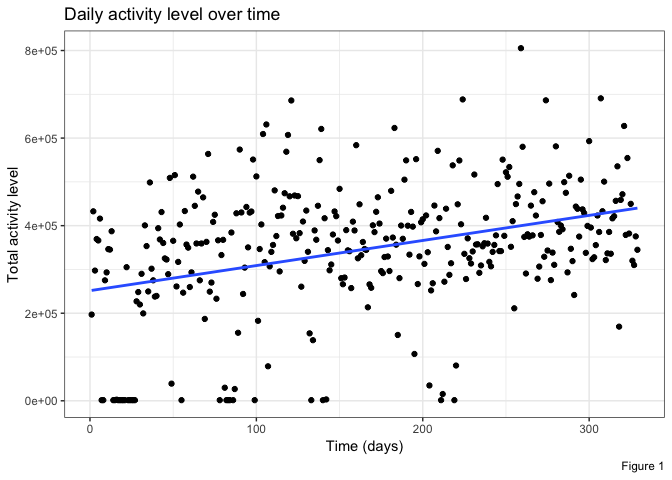
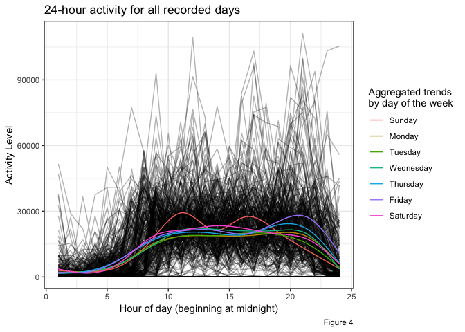

p8105\_mtp\_amv2187
================
Alyssa Vanderbeek
26 October 2018

``` r
accel_data = read.csv('./data/accel_data.csv') %>%
  janitor::clean_names() %>%
  gather(key = minute, value = activity_level, contains('activity')) %>%
  mutate(minute = as.integer(str_sub(minute, 10)),
         day = fct_relevel(day, 'Sunday', 'Monday', 'Tuesday', 'Wednesday', 'Thursday', 'Friday', 'Saturday'),
         hour = ceiling(minute / 60)) %>% # the device records activity units for every minute of the day, so we can break this up into hours of the day, starting at midnight
  arrange(week, day)

str(accel_data)
```

    ## 'data.frame':    473760 obs. of  5 variables:
    ##  $ week          : int  1 1 1 1 1 1 1 1 1 1 ...
    ##  $ day           : Factor w/ 7 levels "Sunday","Monday",..: 1 1 1 1 1 1 1 1 1 1 ...
    ##  $ minute        : int  1 2 3 4 5 6 7 8 9 10 ...
    ##  $ activity_level: num  1 1 1 1 1 1 1 1 1 1 ...
    ##  $ hour          : num  1 1 1 1 1 1 1 1 1 1 ...

``` r
# aggregate daily total activity counts
agg_days = accel_data %>%
  group_by(week, day) %>% # group by week and day
  summarise(total_activity = sum(activity_level)) %>% # get total activity for each day
  ungroup %>%
  mutate(order = row_number()) # order variable to plot later

str(agg_days)
```

    ## Classes 'tbl_df', 'tbl' and 'data.frame':    329 obs. of  4 variables:
    ##  $ week          : int  1 1 1 1 1 1 1 2 2 2 ...
    ##  $ day           : Factor w/ 7 levels "Sunday","Monday",..: 1 2 3 4 5 6 7 1 2 3 ...
    ##  $ total_activity: num  196937 432751 297427 369436 366178 ...
    ##  $ order         : int  1 2 3 4 5 6 7 8 9 10 ...

Data overview
-------------

Here I examine activity levels of a 63-year-old man over the course of several months (47 weeks). The individual has a BMI of 25, and was admitted to the CUMC Advanced Cardiac Care Center for congestive heart failure before participating in this study. The goal of the research is to understand whether activity level changes over time after a major cardiac event, and whether there is potential to gather information about health events from the data surrounding them.

The dataset is comprised of information over 47 weeks (329 days), with information being collected every minute of every day. The resulting dataset is the quite large, with 473760 data points. This information is grouped by week and day of the week, and the minute of the day.

Activity level is measured in voltage by the device, where higher voltage counts indicate higher levels of activity. Of note, there was no missing data per se, but we can understand an activity count of 1 to mean that no activity was recorded in that minute; either the participant was not active or not wearing the device. For example, an entire day of recorded 1 values can be understood as a day on which the man did not wear the device. There were 18 such days recorded.

Exploratory analysis - understanding the data
---------------------------------------------

Upon receiving and tidying the data, I looked at the distribution of activity level and the relationship between activity level and time. There are seemingly many outliers - in particular, disproportionately high minute-to-minute activity counts - in the dataset. In other words, the distribution was highly skewed. Taking the log of the minute-to-minute counts reduces the skewness. However, I am more interested in total activity over an hour or day, which have less skewed distributions.

### Total daily activity over time

We are interested to know whether the man's activity levels increased over time. To do this, we can fit a linear model with the day (1 to 329) as the predictor, and look at the significance of the coefficient. With a p-value &lt;0.0001 for a positive coefficient, we can conclude that activity level did indeed increase over the course of the observed months (Figure 1).

``` r
# linear model to test whether activity changed over time. Significant positive slope says activity increased; significant negative intercept says acitvity decreased. Lack of significance fails to reject the null hypothesis that day over the course of the months of wear does not predict activity level.
summary(lm(agg_days$total_activity ~ agg_days$order))
```

    ## 
    ## Call:
    ## lm(formula = agg_days$total_activity ~ agg_days$order)
    ## 
    ## Residuals:
    ##     Min      1Q  Median      3Q     Max 
    ## -375588  -65862    6795   85227  405407 
    ## 
    ## Coefficients:
    ##                 Estimate Std. Error t value Pr(>|t|)    
    ## (Intercept)    251538.51   15716.21  16.005  < 2e-16 ***
    ## agg_days$order    573.01      82.55   6.941  2.1e-11 ***
    ## ---
    ## Signif. codes:  0 '***' 0.001 '**' 0.01 '*' 0.05 '.' 0.1 ' ' 1
    ## 
    ## Residual standard error: 142200 on 327 degrees of freedom
    ## Multiple R-squared:  0.1284, Adjusted R-squared:  0.1258 
    ## F-statistic: 48.18 on 1 and 327 DF,  p-value: 2.097e-11

``` r
# scatter plot of total activity by day
agg_days %>%
  ggplot(aes(x = order, y = total_activity)) +
  geom_point() + 
  geom_smooth(method = 'lm', se = F)  +
  labs(
    title = 'Daily activity level over time',
    y = 'Total activity level',
    x = 'Time (days)',
    caption = 'Figure 1'
  )
```



Since we also have informatin on the day of the week, we can test the hypothesis that day of the week can also predict activity level. However, an ANOVA test suggests that there is little evidence to suggest a correlation; that is, that the average activity level varies by day of the week (Figure 2a). This holds true when accounting for time (Figure 2b), but note the time itself remained a significant predictor of activity level.

``` r
# ANOVA testing relationship between activity level and day of the week
anova(lm(agg_days$total_activity ~ agg_days$day)) # ANOVA test of difference between means
```

    ## Analysis of Variance Table
    ## 
    ## Response: agg_days$total_activity
    ##               Df     Sum Sq    Mean Sq F value Pr(>F)
    ## agg_days$day   6 2.1742e+11 3.6237e+10  1.5832 0.1513
    ## Residuals    322 7.3699e+12 2.2888e+10

``` r
# boxplot of total daily activity by day of the week
boxplot_dow = agg_days %>%
  ggplot(aes(x = day, y = total_activity, fill = day)) +
  geom_boxplot() +
  labs(
    title = 'Daily activity level by day of the week',
    x = 'Day of the week',
    y = "Total activity level",
    caption = 'Figure 2a'
  ) + 
  theme(legend.position = 'none',
        title = element_text(size = 8),
        axis.text.x = element_text(angle = 60, hjust = 1)) +
  viridis::scale_fill_viridis(
    discrete = T
  )

# ANOVA testing relationship between activity level and day of the week over time
anova(lm(agg_days$total_activity ~ agg_days$day + agg_days$order)) # ANOVA test of difference between means
```

    ## Analysis of Variance Table
    ## 
    ## Response: agg_days$total_activity
    ##                 Df     Sum Sq    Mean Sq F value    Pr(>F)    
    ## agg_days$day     6 2.1742e+11 3.6237e+10  1.8163   0.09532 .  
    ## agg_days$order   1 9.6549e+11 9.6549e+11 48.3917 1.966e-11 ***
    ## Residuals      321 6.4045e+12 1.9952e+10                      
    ## ---
    ## Signif. codes:  0 '***' 0.001 '**' 0.01 '*' 0.05 '.' 0.1 ' ' 1

``` r
# linear fit for total daily activity by day of the week
scatter_dow_time = agg_days %>%
  ggplot(aes(x = order, y = total_activity, color = day)) +
  geom_point() +
  geom_smooth(method = 'lm', se = F) +
  labs(
    title = "Daily activity level by day of the week over time",
    x = 'Time (days)',
    y = 'Total activity level',
    caption = 'Figure 2b'
  ) +
  theme(legend.position = 'none',
        title = element_text(size = 8)) + 
  viridis::scale_color_viridis(
    name = 'Day of the week',
    discrete = T
  )

boxplot_dow + scatter_dow_time
```


### Total activity over the course of the day

I examined the distribution of activity by week, day of the week, and hour of day, and found that the participant was most active during his waking hours, between 7 am and 11 pm, approximately (Figure 3).

``` r
# daily 24-hour activity profile (spaghetti plot)
accel_data %>%
  group_by(week, day, hour) %>% # group by week, day, and hour
  summarise(total_activity_hr = sum(activity_level)) %>% # get total activity for each hour of every day
  ungroup %>%
  mutate(day_over_time = ceiling(row_number()/24)) %>% # variable to group by day 1:329
  ggplot(aes(y = total_activity_hr, x = hour, group = day_over_time, 
             color = day_over_time)) +
  geom_line(alpha = 0.3) +
  labs(
    title = '24-hour activity profile for all recorded days',
    x = 'Hour of day (beginning at 12 am)',
    y = 'Activity Level',
    caption = 'Figure 3',
    color = 'Time (days)'
  ) + 
  theme(legend.position = 'none') +
  viridis::scale_color_viridis()
```



``` r
wordcountaddin::text_stats("p8105_mtp_amv2187.Rmd")
```

| Method          | koRpus      | stringi       |
|:----------------|:------------|:--------------|
| Word count      | 485         | 476           |
| Character count | 2855        | 2854          |
| Sentence count  | 25          | Not available |
| Reading time    | 2.4 minutes | 2.4 minutes   |
